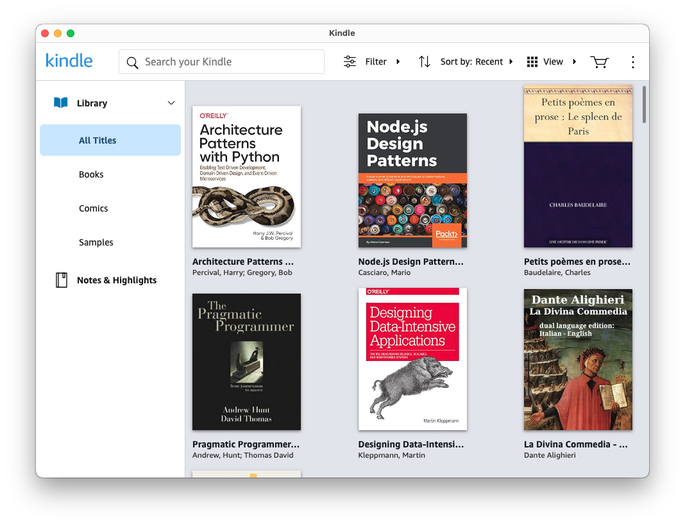

# Kindle Cloud Reader Wrapper

A desktop app that embeds the [Kindle Cloud Reader](https://read.amazon.com),
built using [Electron](https://www.electronjs.org/). It provides a native
macOS-style desktop experience for reading Kindle books on
[older, non-Metal Macs](https://chatgpt.com/share/6850764a-2418-8012-a04d-2d54a038e04e)
and, also, some kind of desktop experience on Linux.



---

## Features

- Opens [https://read.amazon.com](https://read.amazon.com) in a clean desktop window
- Mimics the Kindle app by starting in the location it was in when last closed
- External links open in the default browser
- Build targets for macOS and Linux

---

## Getting Started

### 1. Clone the repository

```bash
git clone https://github.com/yourusername/kindle-cloud-reader-wrapper.git
cd kindle-cloud-reader-wrapper
```

### 2. Install dependencies

```bash
npm install
```

### 3. Run the app

```bash
npm start
```

### 4. Packaging the app

To build for macOS (.app or .dmg) or Linux (.AppImage), run:

```bash
npm run package
```

Output will appear in the `dist/` directory.
See `package.json` → `build` for details.

## Using this code as a template

This code can be easily modified to create PWAs for other web sites,
such as [Yahoo! Mail](https://github.com/evokateur/kindle-cloud-reader-wrapper/tree/yahoo-mail).
